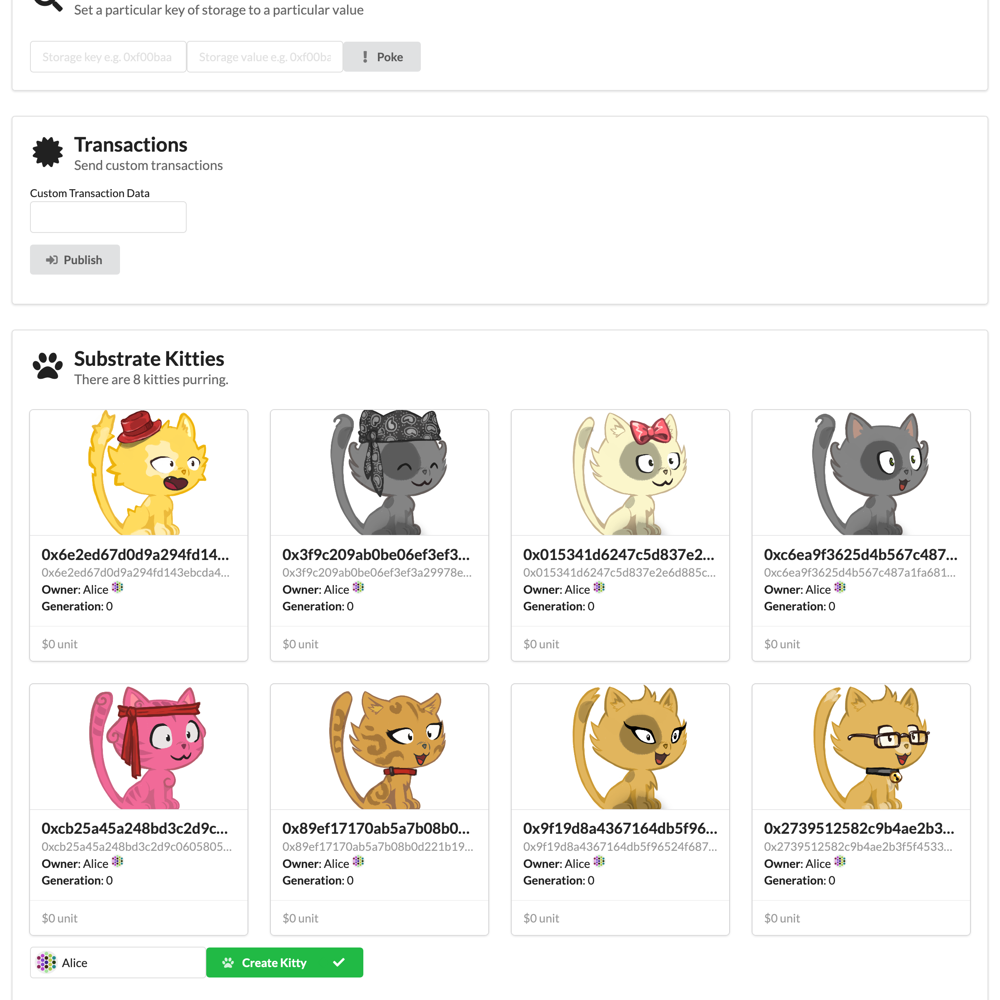

# Substrate Kitties Package

This repository contains a end to end working package of Substrate Kitties repositories.



This includes:

- The Substrate Kitties Pallet
- The Polkadot SDK Minimal Template
- The Substrate Kitties UI

These projects should work together to show an example of a simple decentralized application (DApp) using the Polkadot technology stack.

[Tutorials are available](#tutorials) to learn how to build these projects.

## Creating the Package

This package was created by cloning a few public repositories, and bringing them together.

**Substrate Kitties Pallet**

```
git clone --depth=1 --branch=gitorial https://github.com/shawntabrizi/substrate-collectables-workshop
rm -rf ./substrate-collectables-workshop/.git
```

**Polkadot SDK Minimal Template**

```
git clone --depth=1 --branch=master https://github.com/paritytech/polkadot-sdk-minimal-template
rm -rf ./polkadot-sdk-minimal-template/.git
```

We need to update the minimal template to include the `pallet-kitties`, which is shown in this commit: TODO.

**Substrate Kitties UI**

This project is local to this repo.

## Setup

To run this project, you will need to install some prerequisites and compile the projects.

### Prerequisites

This package uses Rust, NodeJS, and the Polkadot SDK.

To install all the prerequisites needed for Rust and the Polkadot SDK, run:

```sh
curl --proto '=https' --tlsv1.2 https://raw.githubusercontent.com/paritytech/polkadot-sdk/master/scripts/getting-started.sh -sSf | sh
```

To install NodeJS, I recommend you use `nvm` which is a way to install NodeJS and manage which version you use.

See the instructions here: https://github.com/nvm-sh/nvm

### Compiling and Running the Blockchain

Change to the `polkadot-sdk-minimal-template` directory:

```sh
cd polkadot-sdk-minimal-template
```

Then build the node binary:

```sh
cargo build --release
```

This should create the `minimal-template-node` binary which you can run like this:

```sh
./target/release/minimal-template-node --dev
```

This already includes `pallet-kitties` in the runtime.

You should see that blocks are being produced in the terminal logs.

### Running the UI

TODO

## Tutorials

You can learn how to build the different parts of the Substrate Kitties project by following these tutorials.

### Substrate Collectables Workshop

Learn how to build your fist Polkadot SDK Pallet:

https://shawntabrizi.github.io/substrate-collectables-workshop/

### Build a Custom Blockchain

Learn how to build your first custom blockchain:

TODO

### Build a Polkadot SDK Front End

Learn how to build your first Polkadot SDK compatible front end:

TODO
